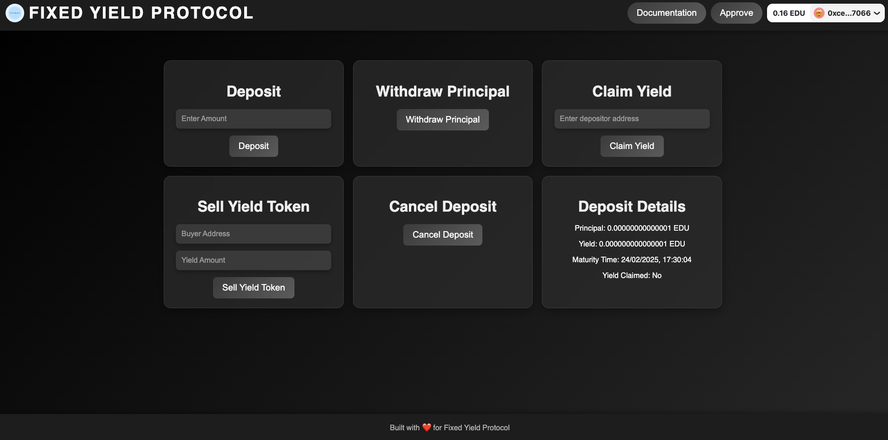

# YieldX

## Project Front Page

Here is a preview of the project's front page:

---

## Introduction

YieldX is a decentralized finance (DeFi) smart contract enabling users to tokenize and trade future yield. This innovative protocol separates asset ownership from its yield, allowing users to secure fixed-rate income or speculate on future yield. With a fixed 60-day maturity period, users can seamlessly trade tokenized yield while benefiting from a transparent and secure system.

---

## Features

- **Depositing:**
  - Users deposit native tokens to receive principal and yield tokens.
  - Deposits have a fixed maturity period of 60 days.

- **Tokenization:**
  - Native token deposits are tokenized into Principal Tokens (PT) and Yield Tokens (YT).
  - Tokens can be traded or held until maturity.

- **Principal Withdrawal:**
  - After the 60-day maturity, users can withdraw their principal in native tokens.

- **Yield Claims:**
  - Yield Tokens can be redeemed for corresponding EDU yield after maturity.

- **Yield Token Trading:**
  - Users can sell their Yield Tokens to other users, enabling yield speculation.
  - A 1% transaction fee applies to Yield Token sales.

- **Cancellation:**
  - Users can cancel deposits before maturity to reclaim their principal (conditions apply).

- **Fee Management:**
  - Admins can update transaction fees for Yield Token sales.

---

## Contract Details

### Deposit and Tokenization
- Deposit native tokens to receive:
  - **Principal Tokens (PT):** Represent the deposit amount.
  - **Yield Tokens (YT):** Represent future yield from the deposit.
- Maturity period: Fixed at **60 days**.
- Interest rate: Fixed at **10%**.

### Principal Withdrawal
- Principal can be withdrawn after the maturity period.
- Users must burn their Principal Tokens (PT) to claim the native tokens.

### Yield Claims
- Yield Tokens (YT) can be redeemed for EDU yield after maturity.
- Yield is calculated based on a **10% interest rate** on the principal amount.

### Yield Token Trading
- Sell Yield Tokens to another user.
- A **1% transaction fee** applies to all trades.
- Enables flexible transfer of future yield.

### Deposit Cancellation
- Users can cancel deposits before maturity.
- Depositors must not have sold any Yield Tokens (YT).
- Upon cancellation, both Principal Tokens and Yield Tokens are burned.

---

## Contract Variables

- **Interest Rate:** Fixed at 10%.
- **Fee Rate:** Initially set at 1% for Yield Token transactions.
- **Maturity Period:** Fixed at 60 days (in seconds).

---

## Functions Overview

### User Functions
- `deposit()`: Deposit native tokens to receive PT and YT.
- `withdrawPrincipal()`: Withdraw the principal after the 60-day maturity period.
- `claimYield(address depositorAddress)`: Claim EDU yield using Yield Tokens (YT).
- `sellYieldToken(address buyer, uint256 yieldAmount)`: Sell Yield Tokens to another user.
- `cancelDeposit()`: Cancel the deposit and reclaim the principal before maturity.

### Admin Functions
- `updateFeeRate(uint256 newFeeRate)`: Update the transaction fee for Yield Token trades.

### Utility Functions
- `getDepositDetails(address user)`: View deposit details for a user.
- `calculateYield(uint256 amount, uint256 interestRate)`: Calculate yield based on principal and interest rate.

---

## Usage Instructions

### Deploy the Contract
1. Deploy the PrincipalToken, YieldToken, and FixedYieldProtocol contracts on a supported blockchain.
2. Initialize the FixedYieldProtocol contract with the addresses of PrincipalToken and YieldToken.

### Deposit Native Tokens
1. Call `deposit()` with the desired amount of native tokens.
2. Receive Principal Tokens (PT) and Yield Tokens (YT).

### Withdraw Principal
1. Wait for the 60-day maturity period.
2. Call `withdrawPrincipal()` to reclaim your principal in native tokens.

### Claim Yield
1. Ensure maturity period has passed.
2. Call `claimYield()` using your Yield Tokens (YT) to receive EDU yield.

### Trade Yield Tokens
1. Call `sellYieldToken(buyer, yieldAmount)` to sell Yield Tokens.
2. Buyer can claim the yield after the maturity period.

### Cancel Deposit
1. Ensure no Yield Tokens (YT) have been traded.
2. Call `cancelDeposit()` to reclaim your principal before maturity.

---

## Events

- `Deposited(address indexed user, uint256 amount, uint256 maturityTime, uint256 interestRate)`
- `YieldTokenSold(address indexed seller, address indexed buyer, uint256 yieldAmount)`
- `PrincipalWithdrawn(address indexed user, uint256 amount)`
- `YieldClaimed(address indexed user, uint256 amount)`
- `DepositCanceled(address indexed user, uint256 principalRefunded)`
- `FeeUpdated(uint256 newFeeRate)`

---

## Security Considerations

- Ensure the contract is audited before deployment.
- Only deposit funds you can afford to lose.
- Monitor the maturity period to avoid missing deadlines.

---

## License

This project is licensed under the MIT License. See the LICENSE file for more details.

---

## Support

For any inquiries or support, please open an issue on the GitHub repository or contact us via email.

---

## Links

- **GitHub Repository:** [YieldX](https://github.com/Anish99594/FixedYieldProtocol.git)
- **Demo Video:** [Watch Here](https://your-demo-video-link)
- **Project Website:** [Visit Here](https://fixed-yield-protocol.vercel.app/)

